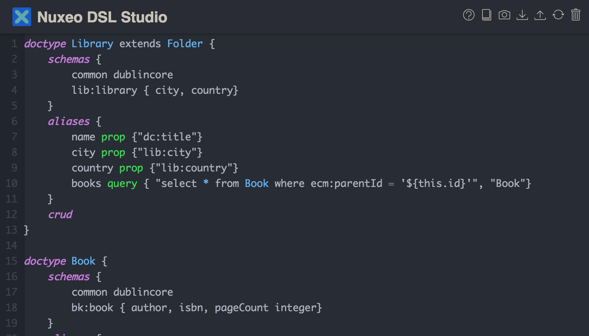

# Nuxeo DSL

What was a toy project to play with [Chevrotain](https://github.com/SAP/chevrotain) to create a Nuxeo Domain Specific language became a new way to customize Nuxeo using a DSL and a new way to query it with GraphQL . 

The idea is to create an interpreter that creates Java descriptor thru Nashorn and an online editor with visual rendition of the domain model (UML style).

## How to build

It's a regular Nuxeo project that you can build with Maven:

    mvn clean install

It then creates a regular Nuxeo package in `nuxeo-dsl-package/nuxeo-dsl-package-1.0.4-SNAPSHOT.zip` that you can install on a Nuxeo distribution. 

## How to run

Thanks to the Nuxeo Docker image it's quite easy to run the package. Simply create a `init` folder where you will copy the `nuxeo-dsl-package-1.0.4-SNAPSHOT.zip` file. After that run the following Docker command :

    docker run --name nuxeo -v "$(pwd)/init":/docker-entrypoint-initnuxeo.d -p 8080:8080 --rm -ti nuxeo:9.10

## How to use

After login at http://${DOCKER_HOST}:8080/ with *Administrator/Administrator* you end up on the Nuxeo DSL editor where you can start editing your model:

A sample domain definitions can  be defined like this:
                
    doctype Library extends Folder {
    schemas {
        common dublincore
          lib:library { city, country}
      }    
      aliases {
        name prop {"dc:title"}
          city prop {"lib:city"}
          country prop {"lib:country"}        
          books query { "select * from Book where ecm:parentId = '${this.id}'", "Book"}
      }
      crud
    }
    
    doctype Book {
      schemas {
        common dublincore
          bk:book { author, isbn, pageCount integer}
      }
      aliases {
        title prop {"dc:title"}
          author prop {"bk:author"}
          isbn  prop {"bk:isbn"}
          pageCount prop {"bk:pageCount"}
      }
      crud
    }
    
    queries {
      libraries:Library "SELECT * From Library"
    }

We define here two document types `Library` and `Book` with some property aliases and a query. Click on the *Sync* button to deploy the code to Nuxeo. 

The two types are now deployed to the repository and we can query it with *graphQL* thru [GraphiQL](http://localhost:8080/nuxeo/graphiql/).

    query libraries {
      libraries {
        _path    
        name
        city
        country
        books {
          _path
          title
          author 
          isbn
        }
      }  
      
    }

    mutation createLibrary{
      createLibrary(Library:{_path:"/" _name:"ucla" lib: { city:"LosAngeles" country: "USA"} }) {
        _id
        _path
        name
      }
    }

    mutation createBook($book: BookInput!) {
      createBook(Book: $book) {
        _id
        title
        author
        isbn      
      }  
    }

    mutation updateBook {
      updateBook(Book: { _path: "/ucla/us" bk: { isbn: "123456", author: "Damien"}}) {
        _id
        title
        author
        isbn
      }
    }

    mutation deleteBook {
      deleteBook(Book: { _path:"/ucla/us"})  
    }
      

# TODO

 * ~~Studio sync~~
 * ~~Doc Facets~~
 * ~~Doc schemas~~
 * ~~GraphQL integration~~
 * ~~GraphiQL in studio~~
 * ~~Alias in grammar~~
 * ~~Alias resolvers~~
 * ~~GraphQL schema reload on HotReload~~
 * ~~Parameterized alias and queries~~
 * ~~Mutations (basic CRUD)~~
 * React library app with Appolo
 * CodeMirror: ~~Syntax higlighting~~ and code completion

# Licensing

Most of the source code in the Nuxeo Platform is copyright Nuxeo and
contributors, and licensed under the Apache License, Version 2.0.

See [/licenses](/licenses) and the documentation page [Licenses](http://doc.nuxeo.com/x/gIK7) for details.

# About Nuxeo

Nuxeo dramatically improves how content-based applications are built, managed and deployed, making customers more agile, innovative and successful. Nuxeo provides a next generation, enterprise ready platform for building traditional and cutting-edge content oriented applications. Combining a powerful application development environment with SaaS-based tools and a modular architecture, the Nuxeo Platform and Products provide clear business value to some of the most recognizable brands including Verizon, Electronic Arts, Sharp, FICO, the U.S. Navy, and Boeing. Nuxeo is headquartered in New York and Paris. More information is available at [www.nuxeo.com](http://www.nuxeo.com).